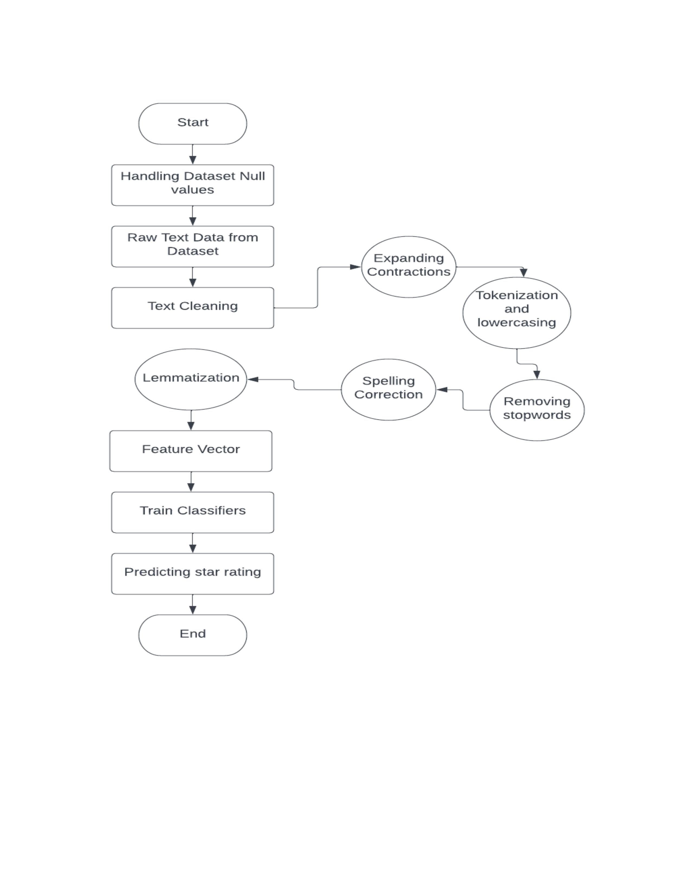

# Star Rating Prediction for Customer Reviews on Smartphones

# Introduction
Huge abundance e-commerce websites and online
reviews have become crucial these days. These reviews help
customers in making decisions but one must go through huge pile
of reviews in many sites. We have summarized the reviews into
STARS on a scale of 1-5 which are easy to perceive. **So, for a
given customer review, we predict the star rating of the review.** We have choosen
precision, recall and F1-scores as our performance metrics.

# Use Case

Source of Img: https://www.amazon.in/New-Apple-iPhone-12-128GB/dp/B08L5TNJHG?th=1
 
**As shown above, a rating is received from the user(in stars) as feedback corresponding to the review of the smartphone. This project aims at predicting
the rating for the reviews corresponding to which the user has not entered any rating.**

# Methodology

# Algorithms Used

* Term frequency-Inverse Document Frequency(TF-IDF)
* Multinomial Naive Bayes(MNB)
* Bigram Multinomial Naive Bayes(Bi-MNB)
* Random Forest(RF)

# About Dataset

The [Dataset](https://www.kaggle.com/datasets/PromptCloudHQ/amazon-reviews-unlocked-mobile-phones) has been collected from Kaggle. It is a corpus of  4,13,840 reviews. 
 
## Context
PromptCloud extracted 400 thousand reviews of unlocked mobile phones sold on Amazon.com to find out insights with respect to reviews, ratings, price and their relationships.

## Content
Given below are the fields:

* Product Title
* Brand
* Price
* Rating
* Review text
* Number of people who found the review helpful

Data was acquired in December, 2016 by the crawlers build to deliver our data extraction services.
 
# Libraries Used

* **pandas**:  load and manipulate the dataset
* **numpy**:  linear algebra and arrays
* **matplotlib** and **seaborn**: to plotting the distribution
* **NLTK, spaCy, textblob, wordcloud**: process the data
* **symspellpy**: spelling correction
* **re**: regular expression
* **contractions**: expanding contractions
* **sklearn, joblib**: feature vector generation and model building

# Results

Note: SC - Spelling Correction

We got an F1-score of **0.74** and **0.89** with **Bigram Multinomial Naive Bayes** and **Random Forest Classifier**.
Random Forest seems best but comparably for larger datasets, its training time will be much more than Multinomial Naive Bayes.

# Prediction on Reviews

## Review - 1

## Review - 2

Elaborative presentation of the work => [Star Rating Prediction](https://docs.google.com/presentation/d/1jWPC47kwKx-dj9R87S0Q8plJXZjShthHp8nNo_HAJxg/edit?usp=sharing)

Link to the Kaggle Notebooks:

1. [Exploratory Data Analysis](https://www.kaggle.com/code/rajatagg/star-rating-prediction-part-1)
2. [Feature Vector Generation](https://www.kaggle.com/code/rajatagg/star-rating-prediction-part-4)
3. [Model Building & Prediction](https://www.kaggle.com/code/rajatagg/star-rating-prediction-re-iterated/notebook?scriptVersionId=97022996)
